# PrismPane Widgets

Just a simple widget tool I'm working on. It was initially built as a Fences Alternative, but working on adding more features.

---

## ✨ Features

All widgets support **custom coloring** and can be organized into **widget groups**.

---

### 🖥️ Monitoring

#### CPU Monitor Widget

Displays the current CPU usage and temperature.

#### RAM Monitor Widget

Displays the current RAM usage.

#### GPU Monitor Widget

Displays the current GPU usage and temperature.

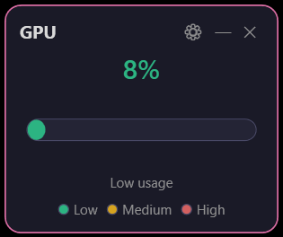

#### Network Traffic Widget

Displays the current network upload and download usage.

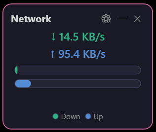

#### Disk Usage Widget

Displays the current disk usage.

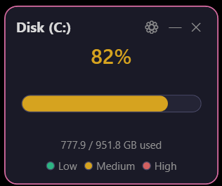

---

### 🎵 Media

#### Media Control Widget

Displays the current media playing on your system and allows you to control it.

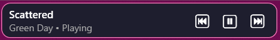

#### Slideshow Widget

Lets you select a folder of images and displays them as a slideshow.

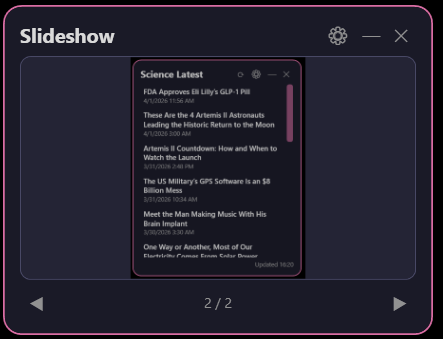

#### Video Widget

Lets you select a video file and play it in the widget.

---

### 📋 Productivity

#### Folder Widget

Lets you select a specific folder on your drive and display all the icons in that folder.

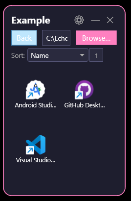

#### Shortcut Panel Widget

Lets you add specific shortcuts and add arguments to them.

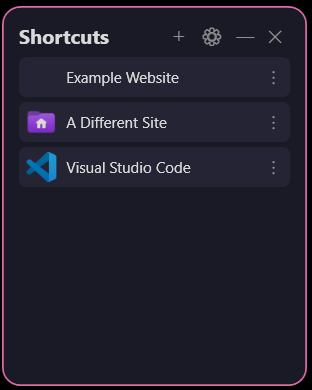

#### Clock Widget

Displays the current time and date, now with custom colors.

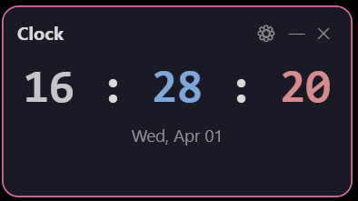

#### Weather Widget

Displays the current weather for a specific location with up to a 7-day forecast.

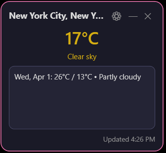

#### Sticky Notes Widget

Lets you create sticky notes on your desktop.

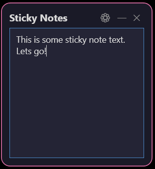

#### RSS Feed Widget

Displays the latest news from a specific RSS feed.

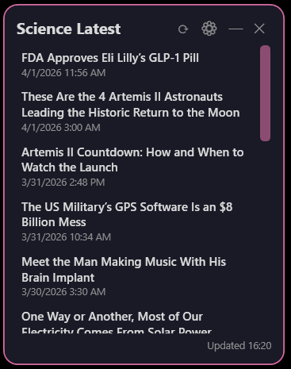

#### Title Bar Widget

A customizable title bar widget.

---

## ⚙️ Settings

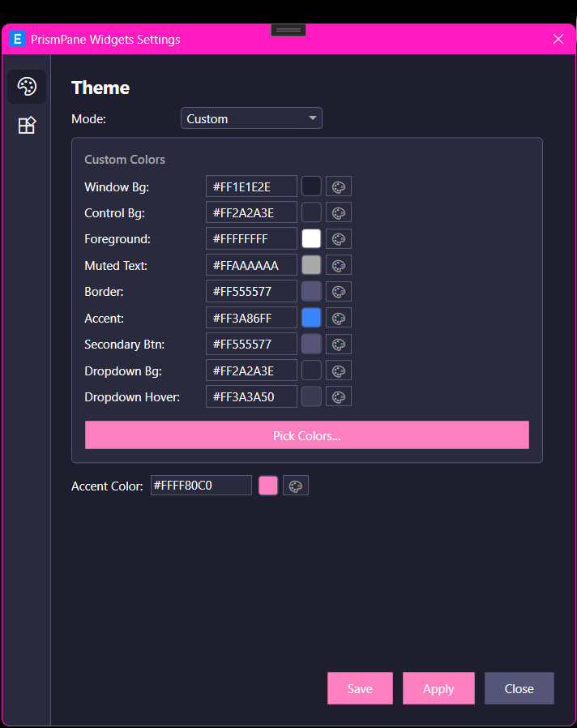

---

## 📝 To Do

* Add more widget settings
* Add a Random widgets category for poems, insults, quotes, and random facts
* Bug Fixes